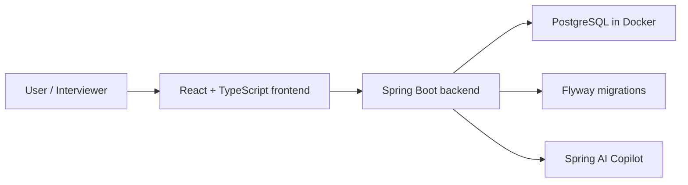

# FlowAI

[中文 README](./README.zh-CN.md)

FlowAI is a workspace-first, AI-assisted task management MVP inspired by Linear and project issue trackers. It is built as a portfolio project for software engineering, full-stack, and backend internship applications in Auckland.

The goal is not to clone Linear completely. The goal is to build a focused, production-shaped MVP that demonstrates backend engineering, database design, frontend integration, Docker-based local development, automated testing, and clear technical communication.

## Current Status

FlowAI has completed the main work for **Phases 0–3**. In **Phase 4**, Analytics and the Spring AI Copilot are complete; the LangGraph Agent remains a separate follow-up.

Implemented now:

- Multi-workspace authentication, memberships, invitations, projects, workflow states, labels, issues, comments, activity, archive/restore, and tenant constraints.
- Linear-style board and list views with filtering, cursor pagination, drag-and-drop ordering, and optimistic rollback.
- Analytics overview with completion trends and status/assignee distributions.
- Spring AI Issue Breakdown with bounded context, structured validation, one repair, editable review UI, and transactional idempotent Apply.
- Issue and Project Summaries with server-owned source statistics, truncation indicators, persisted drafts, URL restoration, copy, and refresh.
- Creator-scoped AI Suggestion Get/Dismiss/Expire lifecycle, shared user/workspace AI rate limiting, low-cardinality metrics, safe logs, and an opt-in real-provider smoke test.
- JUnit, Testcontainers PostgreSQL, Vitest, and Playwright coverage.

Planned next:

- Python/FastAPI/LangGraph project-planning Agent with checkpointing and human approval.
- Optional MCP exposure after the Agent tool contracts stabilize.
- Deployment and portfolio/demo hardening.

## Tech Stack

### Implemented Now

| Area | Technology |
| --- | --- |
| Backend | Java 21, Spring Boot 3.5.x |
| API | Spring Web, Spring Validation |
| Persistence | Spring Data JPA, Hibernate, PostgreSQL |
| Migration | Flyway |
| Security | Spring Security, JWT resource server, BCrypt |
| Tokens | Access tokens plus refresh-token rotation |
| Health checks | Spring Boot Actuator |
| Testing foundation | JUnit 5, Testcontainers |
| Local infrastructure | Docker Compose, PostgreSQL 17 Alpine |
| Frontend | React, TypeScript, Vite |
| Frontend state and routing | React Router, TanStack Query |
| Forms | React Hook Form, Zod |
| Board interaction | dnd-kit |
| Styling | Tailwind CSS, shadcn/ui |
| AI Copilot | Spring AI structured breakdown, Issue/Project summaries, draft lifecycle, and human confirmation |
| AI engineering | Prompt versioning, one repair, token/latency metrics, rate limiting, provider smoke test |

### Planned Next

| Area | Technology or Capability |
| --- | --- |
| Agent | Python, FastAPI, LangGraph, checkpointing, human-in-the-loop |
| Interoperability | Optional MCP after stable tool contracts |

## Architecture



Docker Compose supports the PostgreSQL, Spring Boot, and Nginx/React stack. For faster iteration, developers can also run only PostgreSQL in Docker and start the backend/frontend locally.

## Getting Started

### Prerequisites

- Java 21
- Node.js and npm
- Docker Desktop

### 1. Configure Environment Variables

Create a local `.env` from the example file:

```bash
cp .env.example .env
```

Then fill in local values as needed. Do not commit `.env`.

The chat model defaults to `none`, so normal startup and tests do not need a provider key. To enable OpenAI, set `AI_ENABLED=true`, `SPRING_AI_MODEL_CHAT=openai`, and `OPENAI_API_KEY`.

### 2. Start PostgreSQL

From the repository root:

```bash
docker compose up -d postgres
```

PostgreSQL will be available at:

- Host: `localhost`
- Port: `5432`
- Database: `flowai`
- User: `flowai`
- Password: `flowai_dev_password`

### 3. Start the Backend

```bash
cd backend
set -a; source ../.env; set +a
./mvnw spring-boot:run
```

Health check:

```bash
curl http://localhost:8080/actuator/health
```

Expected response:

```json
{"status":"UP"}
```

### 4. Start the Frontend

```bash
cd frontend
npm run dev
```

The Vite development URL is usually:

```text
http://localhost:5173/
```

## Selected APIs

| Method | Endpoint | Purpose |
| --- | --- | --- |
| `POST` | `/api/auth/register` | Create user, default workspace, owner membership, and tokens |
| `POST` | `/api/auth/login` | Authenticate with email and password |
| `POST` | `/api/auth/refresh` | Rotate refresh token and issue a new access token |
| `GET` | `/api/me` | Return current session: user plus workspace |
| `GET` | `/api/workspaces/current` | Return current workspace from JWT context |
| `GET` | `/api/workspaces/current/members` | Return members of the current workspace |

Authenticated requests use:

```http
Authorization: Bearer <access-token>
```

## Verification

Backend:

```bash
cd backend
set -a; source ../.env; set +a
./mvnw test
./mvnw -Pintegration verify
```

Frontend:

```bash
cd frontend
npm run build
npm run lint
npm test
npm run test:e2e
```

Core acceptance checks:

- A new user can register.
- Registration creates a default workspace and `OWNER` membership.
- Login returns access and refresh tokens.
- `/api/me` returns `user` and `workspace`.
- `/app` is protected from unauthenticated access.
- The frontend stores tokens, attaches `Authorization`, refreshes expired access tokens, and signs out when refresh fails.

## Demo Account

There is no committed seeded demo account yet.

Use the registration page to create a local account. A seeded demo account can be added later when Phase 2 or deployment setup needs repeatable demos.

## Roadmap

| Phase | Focus | Status |
| --- | --- | --- |
| Phase 0 | Project positioning and engineering setup | Completed |
| Phase 1 | Authentication, workspace membership, JWT, protected app shell | Completed locally |
| Phase 2 | Projects, project members, issues, comments, and activity | Main scope completed |
| Phase 3 | Linear-style application experience and kanban board | Main scope completed |
| Phase 4 | Analytics, Spring AI Copilot, and LangGraph Agent | In progress: Analytics and Spring AI Copilot completed; Agent pending |
| Phase 5 | Tests, full Docker Compose, deployment, interview materials | Planned |

## Project Notes

FlowAI is intentionally being built in small, interview-friendly phases. Each phase should leave the project runnable and explainable, so the repository can show both engineering progress and decision-making process.

More detail:

- [MVP Roadmap](./docs/mvp-roadmap.en.md)
- [Phase 1 Design Notes](./docs/phase-1-auth-workspace.en.md)
