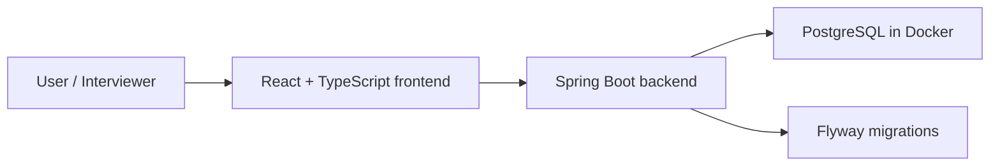

# FlowAI

[中文 README](./README.zh-CN.md)

FlowAI is a Linear-inspired, AI-assisted task management MVP built as a portfolio project for software engineering, full-stack, and backend internship applications in Auckland.

The goal is not to clone Linear completely. The goal is to build a focused, production-shaped MVP that demonstrates backend engineering, database design, frontend interaction, Docker-based local development, automated testing, and clear technical communication.

## Current Status

FlowAI is currently in **Phase 0: project positioning and engineering setup**.

Implemented now:

- Monorepo structure with `backend/`, `frontend/`, and `docs/`.
- Spring Boot backend skeleton with PostgreSQL, Flyway, Spring Security, Actuator, JPA, Validation, and Testcontainers dependencies.
- PostgreSQL development database through Docker Compose.
- Vite React TypeScript frontend skeleton.
- Tailwind CSS, shadcn/ui, React Router, and TanStack Query wired into the frontend.
- Public backend health check endpoint available through Spring Boot Actuator.

Not implemented yet:

- User registration and login.
- JWT authentication.
- Organization, workspace, member, project, and issue domain models.
- Linear-style issue list and kanban board.
- AI-assisted issue breakdown and summary features.
- Production deployment configuration.

## Tech Stack

### Implemented Now

| Area | Technology |
| --- | --- |
| Backend | Java 21, Spring Boot 3.5.x |
| API | Spring Web, Spring Validation |
| Persistence | Spring Data JPA, Hibernate, PostgreSQL |
| Migration | Flyway |
| Security foundation | Spring Security |
| Health checks | Spring Boot Actuator |
| Testing foundation | JUnit 5, Testcontainers |
| Local infrastructure | Docker Compose, PostgreSQL 17 Alpine |
| Frontend | React, TypeScript, Vite |
| Frontend state and routing | React Router, TanStack Query |
| Styling | Tailwind CSS, shadcn/ui |

### Planned Next

| Area | Technology or Capability |
| --- | --- |
| Authentication | Spring Security with JWT |
| Forms | React Hook Form, Zod |
| Multi-tenancy | Organization and workspace isolation |
| Task management | Projects, issues, workflow states, labels, comments, activity events |
| Board interaction | dnd-kit |
| AI features | Spring AI |
| Analytics | Recharts |
| Deployment | Full Docker Compose application stack |

## Architecture



During Phase 0, Docker Compose starts PostgreSQL only. The backend and frontend are run locally for development.

## Getting Started

### Prerequisites

- Java 21
- Node.js and npm
- Docker Desktop

### 1. Start PostgreSQL

From the repository root:

```bash
docker compose up -d postgres
```

PostgreSQL will be available at:

- Host: `localhost`
- Port: `5432`
- Database: `flowai`
- User: `flowai`
- Password: `flowai_dev_password`

### 2. Start the backend

```bash
cd backend
./mvnw spring-boot:run
```

The backend uses the database configured in `backend/src/main/resources/application.yaml`.

Health check:

```bash
curl http://localhost:8080/actuator/health
```

Expected response:

```json
{"status":"UP"}
```

### 3. Start the frontend

```bash
cd frontend
npm run dev
```

The frontend development server is provided by Vite. The terminal output will show the local URL, usually:

```text
http://localhost:5173/
```

## Verification

Backend:

```bash
cd backend
./mvnw test
```

Frontend:

```bash
cd frontend
npm run build
npm run lint
```

Phase 0 acceptance checks:

- `docker compose up -d postgres` starts PostgreSQL.
- Backend health check returns `UP`.
- Frontend home page is accessible in the browser.
- README explains the project positioning, stack, architecture, and startup commands.

## Demo Account

Demo account placeholder:

- Email: `demo@flowai.local`
- Password: `flowai-demo-password`

Authentication is planned for Phase 1. The demo account will become active after registration, login, JWT authentication, and seed data are implemented.

## Roadmap

| Phase | Focus | Status |
| --- | --- | --- |
| Phase 0 | Project positioning and engineering setup | In progress |
| Phase 1 | Authentication, organizations, workspaces, roles, JWT | Planned |
| Phase 2 | Core task management: projects, issues, comments, activities | Planned |
| Phase 3 | Linear-style application experience and kanban board | Planned |
| Phase 4 | AI issue breakdown, summaries, and analytics | Planned |
| Phase 5 | Tests, Dockerized full stack, deployment, interview materials | Planned |

## Project Notes

FlowAI is intentionally being built in small, interview-friendly phases. Each phase should leave the project runnable and explainable, so the repository can show both engineering progress and decision-making process.
