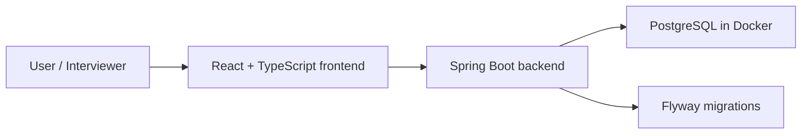

# FlowAI

[中文 README](./README.zh-CN.md)

FlowAI is a workspace-first, AI-assisted task management MVP inspired by Linear and project issue trackers. It is built as a portfolio project for software engineering, full-stack, and backend internship applications in Auckland.

The goal is not to clone Linear completely. The goal is to build a focused, production-shaped MVP that demonstrates backend engineering, database design, frontend integration, Docker-based local development, automated testing, and clear technical communication.

## Current Status

FlowAI has completed **Phase 0: engineering setup** and the main implementation work for **Phase 1: authentication and workspace access**.

Implemented now:

- Monorepo structure with `backend/`, `frontend/`, and `docs/`.
- Spring Boot backend with PostgreSQL, Flyway, Spring Security, JWT resource server, Actuator, JPA, Validation, and Testcontainers.
- PostgreSQL development database through Docker Compose.
- Flyway migrations for users, workspaces, workspace memberships, and refresh tokens.
- Registration, login, token refresh, and `/api/me` session context.
- Workspace-first model: a user can belong to workspaces through memberships; Phase 1 creates a default workspace during registration.
- Protected frontend routes for `/app`.
- Frontend login, registration, token storage, automatic access-token refresh, and current session loading.
- Vite React TypeScript frontend with Tailwind CSS, shadcn/ui, React Router, and TanStack Query.

Planned next:

- Project, project membership or invitation, issue, comment, and activity models.
- Linear-style issue list and kanban board.
- AI-assisted issue breakdown and summary features.
- Analytics and deployment hardening.

## Tech Stack

### Implemented Now

| Area | Technology |
| --- | --- |
| Backend | Java 21, Spring Boot 3.5.x |
| API | Spring Web, Spring Validation |
| Persistence | Spring Data JPA, Hibernate, PostgreSQL |
| Migration | Flyway |
| Security | Spring Security, JWT resource server, BCrypt |
| Tokens | Access tokens plus refresh-token rotation |
| Health checks | Spring Boot Actuator |
| Testing foundation | JUnit 5, Testcontainers |
| Local infrastructure | Docker Compose, PostgreSQL 17 Alpine |
| Frontend | React, TypeScript, Vite |
| Frontend state and routing | React Router, TanStack Query |
| Styling | Tailwind CSS, shadcn/ui |

### Planned Next

| Area | Technology or Capability |
| --- | --- |
| Forms | React Hook Form, Zod |
| Project management | Projects, project members, invitations, issues, comments, activity events |
| Board interaction | dnd-kit |
| AI features | Spring AI powered issue breakdown and summaries |
| Analytics | Recharts |
| Deployment | Full Docker Compose application stack |

## Architecture



During the current development phase, Docker Compose starts PostgreSQL only. The backend and frontend run locally for faster iteration.

## Getting Started

### Prerequisites

- Java 21
- Node.js and npm
- Docker Desktop

### 1. Configure Environment Variables

Create a local `.env` from the example file:

```bash
cp .env.example .env
```

Then fill in local values as needed. Do not commit `.env`.

Current backend startup may require `OPENAI_API_KEY` because the OpenAI Spring AI starter is already present, even though AI product features are planned for a later phase.

### 2. Start PostgreSQL

From the repository root:

```bash
docker compose up -d postgres
```

PostgreSQL will be available at:

- Host: `localhost`
- Port: `5432`
- Database: `flowai`
- User: `flowai`
- Password: `flowai_dev_password`

### 3. Start the Backend

```bash
cd backend
set -a; source ../.env; set +a
./mvnw spring-boot:run
```

Health check:

```bash
curl http://localhost:8080/actuator/health
```

Expected response:

```json
{"status":"UP"}
```

### 4. Start the Frontend

```bash
cd frontend
npm run dev
```

The Vite development URL is usually:

```text
http://localhost:5173/
```

## Phase 1 APIs

| Method | Endpoint | Purpose |
| --- | --- | --- |
| `POST` | `/api/auth/register` | Create user, default workspace, owner membership, and tokens |
| `POST` | `/api/auth/login` | Authenticate with email and password |
| `POST` | `/api/auth/refresh` | Rotate refresh token and issue a new access token |
| `GET` | `/api/me` | Return current session: user plus workspace |
| `GET` | `/api/workspaces/current` | Return current workspace from JWT context |
| `GET` | `/api/workspaces/current/members` | Return members of the current workspace |

Authenticated requests use:

```http
Authorization: Bearer <access-token>
```

## Verification

Backend:

```bash
cd backend
set -a; source ../.env; set +a
./mvnw test
```

Frontend:

```bash
cd frontend
npm run build
npm run lint
```

Phase 1 acceptance checks:

- A new user can register.
- Registration creates a default workspace and `OWNER` membership.
- Login returns access and refresh tokens.
- `/api/me` returns `user` and `workspace`.
- `/app` is protected from unauthenticated access.
- The frontend stores tokens, attaches `Authorization`, refreshes expired access tokens, and signs out when refresh fails.

## Demo Account

There is no committed seeded demo account yet.

Use the registration page to create a local account. A seeded demo account can be added later when Phase 2 or deployment setup needs repeatable demos.

## Roadmap

| Phase | Focus | Status |
| --- | --- | --- |
| Phase 0 | Project positioning and engineering setup | Completed |
| Phase 1 | Authentication, workspace membership, JWT, protected app shell | Completed locally |
| Phase 2 | Projects, project members or invitations, issues, comments, activities | Planned |
| Phase 3 | Linear-style application experience and kanban board | Planned |
| Phase 4 | AI issue breakdown, summaries, and analytics | Planned |
| Phase 5 | Tests, full Docker Compose, deployment, interview materials | Planned |

## Project Notes

FlowAI is intentionally being built in small, interview-friendly phases. Each phase should leave the project runnable and explainable, so the repository can show both engineering progress and decision-making process.

More detail:

- [MVP Roadmap](./docs/mvp-roadmap.en.md)
- [Phase 1 Design Notes](./docs/phase-1-auth-workspace.en.md)
