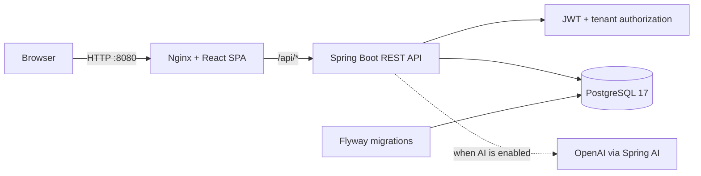

# FlowAI

[](https://github.com/vokyo/FlowAi/actions/workflows/ci.yml)

**Live demo:** [hospitable-friendship-production-52e2.up.railway.app](https://hospitable-friendship-production-52e2.up.railway.app)

FlowAI is a multi-tenant, AI-assisted project and issue management application. It combines Linear-inspired workflows with reviewable AI suggestions, while keeping authorization, tenant isolation, validation, and transactional writes on the server.

The repository is a production-shaped portfolio MVP: it is designed to be runnable, testable, and easy to evaluate without claiming the operational maturity of a hosted production service. This README is the single source of documentation for the project.

## Live Demo

The deployment above runs the same containers as `docker compose up`: an Nginx image that serves the React build and proxies `/api` to the Spring Boot backend, plus managed PostgreSQL.

**Sign in as `demo@flowai.dev` / `demo1234`** to land in a workspace that has been worked in: two projects, four members, 74 issues spread across every column, eight weeks of history, and comment threads. Registering your own email still works and creates a fresh workspace isolated from the demo one.

- The demo workspace is written on startup by a seeder that is off by default and enabled with a single environment variable. It checks for the demo account first, so restarts and redeploys never duplicate it, and a database reset recreates it from scratch. See [Demo Data](#demo-data).
- The three seeded teammates share the same password, so you can sign in as `maya@flowai.dev`, `daniel@flowai.dev`, or `priya@flowai.dev` and see the same workspace from another seat.
- The instance runs on a small hosting plan, so the first request after an idle period can be slow while the container starts.
- Treat it as a demo: do not store real data, and expect the database to be reset from time to time.
- AI Copilot actions require a provider key on the server. `GET /api/ai/status` reports per-feature availability, and the UI disables the Copilot buttons instead of failing on submit when AI is off. The live demo runs with AI off and ships a **pre-generated** Copilot draft instead, so the review-and-apply flow is still explorable — see [Demo Data](#demo-data) for the link that opens it.

## Highlights

### Workspace and project management

- Registration, login, logout, short-lived access tokens, and refresh-token rotation.
- Multiple workspaces with switching, role-aware invitations, membership administration, and account settings.
- Invitation links that support both signing in and registering a new account into an existing workspace.
- Project membership, configurable workflow states, labels, archiving, and restoration.
- Workspace and project authorization enforced by backend services rather than frontend visibility alone.

### Issue execution

- Board and list views with filters, cursor pagination, and URL-restored state.
- Drag-and-drop workflow transitions, persisted ordering, optimistic updates, and rollback on failure.
- Issue details, priorities, assignees, due dates, comments, and activity history.
- Project analytics for total issues, completion rate, completion trend, and status/assignee distribution.

### AI Copilot

- Issue breakdown into editable child-task suggestions.
- Issue and project summaries generated from server-owned context.
- Versioned prompt templates, structured output validation, one bounded repair attempt, and context limits.
- Persisted, creator-scoped suggestions with expiry, dismissal, refresh, and copy flows.
- Human-confirmed, transactional, idempotent Apply instead of autonomous writes.
- User/workspace rate limiting plus low-cardinality `flowai.ai.*` request, duration, token, suggestion, and apply metrics.

### Engineering foundation

- Flyway-managed PostgreSQL schema and database-level tenant referential constraints.
- Consistent API errors and end-to-end `X-Trace-Id` propagation.
- Stateless Spring Security, BCrypt password hashing, role-aware access checks, and Bucket4j rate limiting.
- Docker Compose stack with a non-root backend image and same-origin Nginx reverse proxy.
- Unit, integration, migration, component, and Playwright end-to-end tests in GitHub Actions.

## Current Status

| Phase | Scope | Status |
| --- | --- | --- |
| 0 | Repository, tooling, and local Docker setup | Complete |
| 1 | Authentication, workspaces, memberships, invitations | Complete |
| 2 | Projects, issues, comments, activity, tenant constraints | Complete |
| 3 | Board/list experience, filters, pagination, drag-and-drop | Complete |
| 4 | Analytics and Spring AI Copilot | Complete |
| 5 | Testing, deployment, and application materials | In progress (live deployment and CI done) |
| Next | Python/FastAPI/LangGraph planning agent with checkpointing and human approval | Not started |

Not currently included:

- The LangGraph agent service or MCP exposure.
- A production operations or SLA commitment.

## Architecture


```mermaid
flowchart LR
    Browser["Browser"] -->|"HTTP :8080"| Nginx["Nginx + React SPA"]
    Nginx -->|"/api/*"| API["Spring Boot REST API"]
    API --> Security["JWT + tenant authorization"]
    API --> Database[("PostgreSQL 17")]
    API -. "when AI is enabled" .-> Provider["OpenAI via Spring AI"]
    Flyway["Flyway migrations"] --> Database
```

In the containerized stack, Nginx serves the frontend and proxies API requests to the backend under the same origin, so the browser never makes a cross-origin call and the refresh cookie stays `SameSite=Strict`. During local development, Vite provides the equivalent `/api` proxy. PostgreSQL remains the system of record; AI output is treated as an untrusted draft until it passes validation and a user confirms Apply.

## Technology

| Area | Stack |
| --- | --- |
| Backend | Java 21, Spring Boot 3.5, Spring Web, Spring Validation |
| Security | Spring Security, JWT Resource Server, BCrypt, rotating refresh tokens, Bucket4j |
| Data | PostgreSQL 17, Spring Data JPA, Hibernate, Flyway (16 migrations) |
| Frontend | React 19, TypeScript, Vite, React Router, TanStack Query |
| UI | Tailwind CSS 4, shadcn/ui, Radix UI, dnd-kit, React Hook Form, Zod |
| AI | Spring AI 1.0, structured generation, validation/repair, persisted suggestion lifecycle |
| Observability | Spring Boot Actuator, Micrometer metrics, structured logs, trace IDs |
| Testing | JUnit 5, Testcontainers, Vitest, Testing Library, Playwright |
| Delivery | Docker Compose, multi-stage images, Nginx, GitHub Actions |

## Quick Start

### Option A: run the full stack with Docker

Requirements: Docker Desktop or another Docker installation with Compose v2.

1. Create the local environment file:

   ```bash
   cp .env.example .env
   ```

2. Replace the JWT secret in `.env`:

   ```dotenv
   JWT_SECRET=replace-with-at-least-32-random-bytes
   ```

   The template already ships working local values for `POSTGRES_PASSWORD` (which must match the datasource password) and `REFRESH_COOKIE_SECURE=false` (the local stack serves plain HTTP). Never use any of these development values in a deployed environment.

3. Build and start the stack:

   ```bash
   docker compose up --build -d
   docker compose ps
   ```

4. Verify it:

   ```bash
   curl http://localhost:8080/health
   ```

Open [http://localhost:8080](http://localhost:8080) and register a local account.

### Option B: run services locally for development

Requirements: Java 21, Node.js 22, npm, and Docker.

Start PostgreSQL with the development port override:

```bash
docker compose -f docker-compose.yml -f docker-compose.dev.yml up -d postgres
```

Start the backend:

```bash
cd backend
set -a
source ../.env
set +a
./mvnw spring-boot:run
```

Check backend health:

```bash
curl http://localhost:8080/actuator/health
```

In another terminal, start the frontend:

```bash
cd frontend
npm ci
npm run dev
```

Open [http://localhost:5173](http://localhost:5173).

## Container Operations

Follow the logs of the whole stack or a single service:

```bash
docker compose logs -f
```

Check the backend from inside the network:

```bash
docker compose exec backend curl http://localhost:8080/actuator/health
```

Stop the stack and keep the database:

```bash
docker compose down
```

PostgreSQL data lives in the `flowai_postgres_data` named volume, so `docker compose down` preserves it. To delete local database data permanently:

```bash
docker compose down -v
```

Common issues: port `8080` already in use (set `APP_PORT`), backend datasource authentication failure (`POSTGRES_PASSWORD` and the datasource password disagree), Nginx returning 502 (backend not healthy yet, check `docker compose logs -f backend`).

## AI Configuration

AI is opt-in. Normal startup and automated tests do not require a provider key and do not call an external model.

To enable the Copilot while running the backend locally, set:

```dotenv
AI_ENABLED=true
SPRING_AI_MODEL_CHAT=openai
OPENAI_API_KEY=your-key
AI_MODEL=gpt-4o-mini
```

`docker-compose.yml` forwards `SPRING_AI_MODEL_CHAT` and `OPENAI_API_KEY` but not `AI_ENABLED` or `AI_MODEL`, so the containerized stack starts with the Copilot disabled. To try AI in Compose, add those two variables to the `backend` service environment.

Do not commit `.env` or expose provider keys to frontend code. Model name, timeout, context limits, suggestion TTL, and rate limits are all overridable through [`application.yaml`](./backend/src/main/resources/application.yaml).

## Configuration Reference

Forwarded by `docker-compose.yml`:

| Variable | Default | Purpose |
| --- | --- | --- |
| `POSTGRES_DB` | `flowai` | Compose database name |
| `POSTGRES_USER` | `flowai` | Compose database user |
| `POSTGRES_PASSWORD` | Required | Database password |
| `JWT_SECRET` | Required | HS256 signing secret; use at least 32 random bytes |
| `JWT_ACCESS_TOKEN_TTL` | `15m` | Access-token lifetime |
| `JWT_REFRESH_TOKEN_TTL` | `7d` | Refresh-token lifetime |
| `REFRESH_COOKIE_SECURE` | `true` in the prod profile | Keep `true` behind HTTPS; use `false` only for local HTTP |
| `WORKSPACE_INVITATION_TTL` | `7d` | Invitation link lifetime |
| `APP_PORT` | `8080` | Host port for the containerized application |
| `BACKEND_UPSTREAM` | `backend:8080` | Upstream that Nginx proxies `/api` to; resolved at runtime |
| `SPRING_AI_MODEL_CHAT` | `none` | Selects the Spring AI chat provider |
| `OPENAI_API_KEY` | Empty | Provider credential when OpenAI is enabled |

Backend properties (set them on the backend process or add them to the Compose service):

| Variable | Default | Purpose |
| --- | --- | --- |
| `SPRING_DATASOURCE_URL` / `_USERNAME` / `_PASSWORD` | Local PostgreSQL | Datasource for a non-Compose run |
| `RATE_LIMIT_ENABLED` | `true` | Master switch for the shared Bucket4j limiter used by auth and AI |
| `AI_ENABLED` | `false` | Enables AI application workflows |
| `AI_MODEL` | `gpt-4o-mini` | Chat model name |
| `AI_REQUEST_TIMEOUT` | `30s` | Per-request AI timeout |
| `AI_SUGGESTION_TTL` | `7d` | Suggestion expiry |
| `AI_MAX_BREAKDOWN_ITEMS` | `8` | Cap on generated child tasks |
| `AI_RATE_LIMIT_CAPACITY` / `AI_RATE_LIMIT_WINDOW` | `10` / `1m` | AI generation limit per user and workspace |

For the complete set of options, see [`application.yaml`](./backend/src/main/resources/application.yaml) and [`application-prod.yaml`](./backend/src/main/resources/application-prod.yaml). The prod profile additionally parameterizes the AI context limits (`AI_INCLUDE_COMMENTS_LIMIT`, `AI_INCLUDE_ACTIVITY_LIMIT`, `AI_MAX_CONTEXT_ISSUES`).

## API Overview

| Domain | Representative endpoints |
| --- | --- |
| Authentication | `POST /api/auth/register`, `/login`, `/refresh`, `/logout`, `/register-with-invitation` |
| Current session | `GET /api/me`, `PATCH /api/me/profile`, `PUT /api/me/password`, `DELETE /api/me/sessions` |
| Workspaces | `/api/workspaces`, `POST /api/workspaces/{id}/switch`, `/api/workspaces/current/members` |
| Invitations | `/api/workspaces/current/invitations` (create, reissue, revoke), `/api/workspace-invitations/{token}` (view, accept) |
| Projects | `/api/projects`, project members, labels, workflow states, archive/restore |
| Issues | `/api/issues`, `/api/issues/board`, `PATCH /api/issues/reorder`, state changes, comments, activities |
| Analytics | `GET /api/analytics/overview` |
| AI Copilot | `GET /api/ai/status`, `POST /api/ai/issues/{id}/breakdown`, `POST /api/ai/issues/{id}/summary`, `POST /api/ai/projects/{id}/summary`, `GET`/`POST .../dismiss`/`POST .../apply` under `/api/ai/suggestions/{id}` |

Protected requests use:

```http
Authorization: Bearer <access-token>
```

The refresh token is rotated server-side and delivered as an `HttpOnly`, `SameSite=Strict` cookie scoped to `/api`. Errors share one JSON shape (`code`, `message`, `fieldErrors`, `traceId`), and `management.endpoints.web.exposure` limits Actuator to `health`, `info`, and `metrics`.

`fieldErrors` maps a request field to the reason it was rejected, and is populated only when request-body validation fails:

```json
{
  "code": "VALIDATION_FAILED",
  "message": "Request validation failed",
  "fieldErrors": { "email": "must be a well-formed email address" },
  "traceId": "..."
}
```

It is an empty object on every other error. Conflicts that only the server can detect — a duplicate email, a label name already in use, an incorrect current password — carry their explanation in `message` instead, because they belong to no single request field. The web client validates the same constraints before submitting, so `fieldErrors` is aimed at direct API callers rather than the UI.

## Verification

Backend unit tests:

```bash
cd backend
./mvnw test
```

Backend integration and migration tests (Docker required):

```bash
cd backend
./mvnw -Pintegration verify
```

Frontend checks:

```bash
cd frontend
npm ci
npm run lint
npm test
npm run build
```

Browser end-to-end tests (Docker and Chromium required):

```bash
cd frontend
npx playwright install chromium
npm run test:e2e
```

Playwright starts an isolated Spring Boot test application on port `18080` against a temporary Testcontainers PostgreSQL database, plus Vite on port `4173`. It does not reuse the development database or the normal `5173`/`8080` services.

CI runs frontend lint/test/build, backend unit tests, Testcontainers integration tests, a fresh-database Flyway check, a fresh-database demo seeder check, Playwright workflows, and a Docker Compose stack check that verifies `/health` plus same-origin registration over both plain HTTP and a TLS-terminated `X-Forwarded-Proto: https` request.

## Deployment Notes

The live instance runs the two images built from this repository on a container PaaS, with managed PostgreSQL. What the platform environment needs beyond the Compose defaults:

- `SPRING_PROFILES_ACTIVE=prod` for the graceful-shutdown, forwarded-headers, and structured-logging configuration.
- `BACKEND_UPSTREAM` pointing at the platform's private backend hostname. Nginx re-resolves it every 10 seconds so a backend redeploy does not leave the proxy holding a stale IP.
- `REFRESH_COOKIE_SECURE=true`, since the platform terminates TLS. Nginx forwards the original scheme through `X-Forwarded-Proto`, and the backend reads it with `forward-headers-strategy: framework`, so redirect and cookie decisions see `https`.
- `JWT_SECRET`, datasource credentials, and — only if the Copilot should be live — `AI_ENABLED`, `SPRING_AI_MODEL_CHAT`, and `OPENAI_API_KEY`.
- `DEMO_SEED_ENABLED=true` on a public demo instance, which populates the workspace described under [Demo Data](#demo-data). Leave it unset anywhere real.

Flyway runs on backend startup, so a deploy migrates the database before serving traffic.

## Demo Data

A visitor who lands in an empty workspace cannot see any of what this README claims. The backend therefore ships a seeder that writes one worked-in workspace on startup. It is off by default; the live deployment turns it on with one environment variable, and moving the demo to another platform means setting that variable there.

| Variable | Default | Purpose |
| --- | --- | --- |
| `DEMO_SEED_ENABLED` | `false` | Turns the seeder on. Nothing is registered in the application context while it is off. |
| `DEMO_SEED_EMAIL` | `demo@flowai.dev` | Demo account, and the marker the idempotency check reads. |
| `DEMO_SEED_PASSWORD` | `demo1234` | Password for the demo account and the seeded teammates. |
| `DEMO_SEED_WORKSPACE_NAME` | `Northwind Labs` | Name of the seeded workspace. |

What it writes: one workspace, four members across three roles, two projects (five and four workflow states), 74 issues with cards in every column, ten labels, a spread of priorities and assignees, 16 comments over five issues, and one saved AI Copilot draft. Issue creation and completion times are spread across the past eight weeks, so the analytics completion trend has shape instead of collapsing onto today: completions cluster onto shared days carrying one to four each, with empty days between them and none on a weekend. The Web Platform project holds 56 issues, above the 50-issue page size, so the issue list actually pages.

How it behaves:

- **Idempotent.** The first thing it does is check whether the demo account exists; if it does it returns without writing. Restarts, redeploys and manual re-runs are no-ops.
- **Atomic.** The whole dataset is written in one transaction. A failure part way through rolls back rather than leaving the demo account behind, which would make every later run skip a workspace that was never finished.
- **Not a migration.** It is an `ApplicationRunner`, not Flyway, so a database reset recreates the data and schema history stays free of demo rows.
- **Through the service layer.** Registration hands back an access token, the seeder decodes it into the same `Jwt` the resource server hands a controller, and every write goes through the ordinary services. Tenant scoping, validation, project membership, board placement and activity records all apply, so seeded rows are indistinguishable from rows a user created. No SQL, no direct repository writes.

### The seeded Copilot draft

The live demo runs with `AI_ENABLED` off on purpose: an open demo with a live provider key lets any visitor spend real money, and rate limiting is per user and per workspace, so everyone sharing the demo account collides on one bucket. Seeding a draft that was never generated costs nothing and still shows the editable review and the Apply flow the project is built around — Apply only ever reads the stored draft, so it works end to end with the provider off.

Two consequences worth knowing:

- With AI off the Copilot button is disabled, so the draft is reached by URL. The seeder logs the exact link on startup:
  `/app/workspaces/{workspaceId}/projects/{projectId}/issues/{issueId}?copilot=breakdown&aiSuggestionType=breakdown&aiSuggestion={suggestionId}`
- A draft expires after `AI_SUGGESTION_TTL` (default `7d`) and an expired draft cannot be applied. A long-lived demo should set `AI_SUGGESTION_TTL` to something like `3650d`, or re-seed on a reset.

### Keeping it honest

`DemoSeedIntegrationTests` runs in CI beside the Flyway check: it starts a clean PostgreSQL 17 container, migrates it, runs the seeder, and asserts the workspace, the issue count, that a second run changes nothing, that the list pages to a second page, that assignee, label, priority and text filters all return results, that every board column holds issues, that the completion trend has many points rather than one, and that the saved draft is still an applicable `DRAFT`.

## Repository Layout

```text
FlowAI/
├── backend/                  Spring Boot API, domain logic, migrations, prompts, tests
├── frontend/                 React application, component tests, Playwright tests
├── docker-compose.yml        Full application stack
├── docker-compose.dev.yml    Local PostgreSQL port override
├── .env.example              Local environment template
└── .github/workflows/        Continuous integration
```

## Design Boundaries

- Every authenticated request resolves its current workspace from a server-validated membership claim.
- Project resources require an active project membership; inaccessible resources are not exposed across tenants.
- Cross-tenant relationships are constrained in PostgreSQL as well as in service-layer checks.
- AI prompts use bounded server-owned context, and generated content cannot write to domain tables until validation and explicit user confirmation succeed.
- Apply operations are transactional and idempotent so a safe retry does not duplicate created issues.
