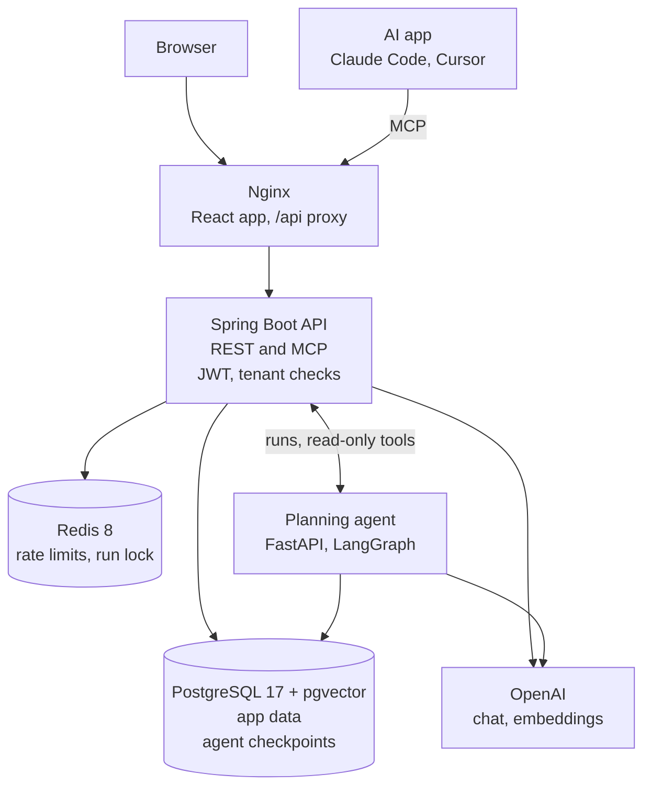

# FlowAI

[](https://github.com/vokyo/FlowAi/actions/workflows/ci.yml)

**Live demo:** [hospitable-friendship-production-52e2.up.railway.app](https://hospitable-friendship-production-52e2.up.railway.app)

FlowAI is a multi-tenant, AI-assisted project and issue management application. Its centerpiece is a **planning agent**: given a goal, a LangGraph agent searches the project's own issues and members through read-only tools, proposes a plan that reuses work already tracked, and stops for a person to review, revise, or approve it. Nothing is written to the project until a version is approved. Around it sit Linear-inspired workflows and reviewable Copilot suggestions, with authorization, tenant isolation, validation, and transactional writes kept on the server.

The repository is a production-shaped portfolio MVP: it is designed to be runnable, testable, and easy to evaluate without claiming the operational maturity of a hosted production service. This README is the single source of documentation for the project.

## Live Demo

The deployment above runs the same containers as `docker compose up`: an Nginx image that serves the React build and proxies `/api` to the Spring Boot backend, plus the planning agent, Redis, and managed PostgreSQL.

**Press "Explore the demo workspace" on the sign-in page** to land in a workspace that has been worked in: two projects, four members, 74 issues spread across every column, eight weeks of history, and comment threads. No typing, no sign-up. The account behind the button is `demo@flowai.dev` / `demo1234` if you would rather sign in by hand, and registering your own email still works and creates a fresh workspace isolated from the demo one.

- The demo workspace is written on startup by a seeder that is off by default and enabled with a single environment variable. It checks for the demo account first, so restarts and redeploys never duplicate it, and a database reset recreates it from scratch. See [Demo Data](#demo-data).
- The button appears only where that variable is set: the sign-in page asks `GET /api/demo/status`, and a deployment that never enabled seeding reports `enabled: false` and shows an ordinary sign-in form. There is no second switch and no demo account baked into the frontend build.
- The three seeded teammates share the same password, so you can sign in as `maya@flowai.dev`, `daniel@flowai.dev`, or `priya@flowai.dev` and see the same workspace from another seat.
- The instance runs on a small hosting plan, so the first request after an idle period can be slow while the container starts.
- Treat it as a demo: do not store real data, and expect the database to be reset from time to time.
- AI Copilot actions require a provider key on the server. `GET /api/ai/status` reports per-feature availability, and the UI disables the Copilot buttons instead of failing on submit when AI is off. The live demo runs with AI off and ships a **pre-generated** Copilot draft instead, so the review-and-apply flow is still explorable — see [Demo Data](#demo-data) for the link that opens it.
- The planning agent runs on the live demo, on gpt-4o-mini and with a few runs an hour, because every visitor shares the demo account. Open **Planning agent** in a project's sidebar; a plan takes 10 to 40 seconds.

## Highlights

### AI planning agent

- A goal becomes a plan built from the project's own data. The agent searches issues by meaning (pgvector) and lists members through two read-only tools, within a budget of 4 model rounds and 8 tool calls, and names the existing issues that already cover part of the goal before it proposes new ones.
- Every plan is checked twice: the agent drops assignees who are not members and issues it never saw, and the backend validates limits, membership, active issues, and due dates when a version is saved and again when it is approved.
- A run stops at a LangGraph interrupt and keeps its state in a PostgreSQL checkpoint. A revision resumes from the checkpoint of the version under review, so a failed or interrupted revision cannot swallow the next one, and a run survives a restart of the agent service.
- Up to five versions per run. Only the latest can be approved, and only with the content hash of the version the person read; approval creates the issues in one idempotent transaction.
- The agent never sees the user's token. It gets one bound to a single run and project, reads through internal endpoints with a security chain of their own, and keeps its checkpoints in its own schema under a database role that cannot touch the application's tables.
- Measured rather than assumed: on a 985-issue project the agent found 65% of the issues people marked relevant, against 50% for a single retrieval and 12% for the newest 100 issues, while sending every issue costs 9.4 times the tokens. See [Evaluation](#evaluation).
- A Planning agent page in every project starts runs, reviews and revises plans, and approves or cancels them; the open run lives in the URL.

### Workspace and project management

- Registration, login, logout, short-lived access tokens, and refresh-token rotation with replay detection.
- Multiple workspaces with switching, role-aware invitations, membership administration, and account settings.
- Invitation links that support both signing in and registering a new account into an existing workspace.
- Project membership, configurable workflow states, labels, archiving, and restoration.
- Workspace and project authorization enforced by backend services rather than frontend visibility alone.

### Issue execution

- Board and list views with filters, cursor pagination, and URL-restored state.
- Drag-and-drop workflow transitions, persisted ordering, optimistic updates, and rollback on failure.
- Issue details, priorities, assignees, due dates, comments, and activity history.
- Project analytics for total issues, completion rate, completion trend, and status/assignee distribution.

### AI Copilot

- Issue breakdown into editable child-task suggestions.
- Issue and project summaries generated from server-owned context.
- Versioned prompt templates, structured output validation, one bounded repair attempt, and context limits.
- Persisted, creator-scoped suggestions with expiry, dismissal, refresh, and copy flows.
- Human-confirmed, transactional, idempotent Apply instead of autonomous writes.
- User/workspace rate limiting plus low-cardinality `flowai.ai.*` request, duration, token, suggestion, and apply metrics.

### Engineering foundation

- Flyway-managed PostgreSQL schema and database-level tenant referential constraints.
- Consistent API errors and end-to-end `X-Trace-Id` propagation.
- Stateless Spring Security, BCrypt password hashing, role-aware access checks, and token-bucket rate limiting that Redis shares across instances.
- Rotated refresh tokens whose replay revokes the membership's sessions instead of only failing the request.
- Logging out, changing the password or signing out everywhere ends existing access tokens on their next request, not when they expire.
- Personal access tokens for AI apps, created and revoked in settings: shown once, stored as a hash, bound to one workspace, expiring after 30, 90 or 365 days, and usable only at the MCP endpoint.
- Docker Compose stack with a non-root backend image and same-origin Nginx reverse proxy.
- Unit, integration, migration, component, and Playwright end-to-end tests in GitHub Actions.

## Current Status

| Phase | Scope | Status |
| --- | --- | --- |
| 0 | Repository, tooling, and local Docker setup | Complete |
| 1 | Authentication, workspaces, memberships, invitations | Complete |
| 2 | Projects, issues, comments, activity, tenant constraints | Complete |
| 3 | Board/list experience, filters, pagination, drag-and-drop | Complete |
| 4 | Analytics and Spring AI Copilot | Complete |
| 5 | Testing, deployment, and application materials | In progress (live deployment and CI done) |
| 6 | Python/FastAPI/LangGraph planning agent with semantic issue search, checkpointing, and human review | Complete |
| 7 | Redis-shared rate limits and planning-run lock, immediate access-token revocation, MCP server for AI apps | Complete |
| Next | A standalone agent README and a larger evaluation set | Planned |

Not currently included:

- A production operations or SLA commitment.
- OAuth sign-in for AI apps: they connect with a personal access token, so an app that accepts only OAuth cannot connect yet.

## Architecture


```mermaid
flowchart TB
    Browser["Browser"]
    AiApp["AI app<br/>Claude Code, Cursor"]
    Nginx["Nginx<br/>React app, /api proxy"]
    API["Spring Boot API<br/>REST and MCP<br/>JWT, tenant checks"]
    Redis[("Redis 8<br/>rate limits, run lock")]
    Agent["Planning agent<br/>FastAPI, LangGraph"]
    DB[("PostgreSQL 17 + pgvector<br/>app data<br/>agent checkpoints")]
    OpenAI["OpenAI<br/>chat, embeddings"]

    Browser --> Nginx
    AiApp -->|MCP| Nginx
    Nginx --> API
    API --> Redis
    API <-->|"runs, read-only tools"| Agent
    API --> DB
    API --> OpenAI
    Agent --> DB
    Agent --> OpenAI
```

The planning agent is a separate Python service that only the backend calls. The backend checks access, applies the AI rate limit and the run lock, and stores every version of a plan; the agent holds a run's working state in its checkpoints, which it keeps in a schema of its own under a database role that cannot reach the application's tables, and reads project data back through the backend's read-only endpoints with a token scoped to one run.

Redis, the planning agent, and the AI features are each turned on by configuration (`REDIS_ENABLED`, `AGENT_ENABLED`, `AI_ENABLED` and the Spring AI model settings), and the application works with any of them off; the live demo runs Redis and the agent. Flyway migrates PostgreSQL when the backend starts.

In the containerized stack, Nginx serves the frontend and proxies API requests to the backend under the same origin, so the browser never makes a cross-origin call and the refresh cookie stays `SameSite=Strict`. During local development, Vite provides the equivalent `/api` proxy. PostgreSQL remains the system of record; AI output is treated as an untrusted draft until it passes validation and a user confirms Apply.

## Technology

| Area | Stack |
| --- | --- |
| Backend | Java 21, Spring Boot 3.5, Spring Web, Spring Validation |
| Security | Spring Security, JWT Resource Server, BCrypt, rotating refresh tokens, Bucket4j |
| Data | PostgreSQL 17, Spring Data JPA, Hibernate, Flyway (23 migrations), Redis 8 for state shared between instances |
| Frontend | React 19, TypeScript, Vite, React Router, TanStack Query |
| UI | Tailwind CSS 4, shadcn/ui, Radix UI, dnd-kit, React Hook Form, Zod |
| AI | Spring AI 1.1, structured generation, validation/repair, persisted suggestion lifecycle, MCP server (Streamable HTTP) |
| Agent | Python 3.14, FastAPI, LangGraph with a PostgreSQL checkpointer, LangChain OpenAI, Pydantic; pytest, Ruff, Pyright in strict mode |
| Observability | Spring Boot Actuator, Micrometer metrics, structured logs, trace IDs |
| Testing | JUnit 5, Testcontainers, Vitest, Testing Library, Playwright |
| Delivery | Docker Compose, multi-stage images, Nginx, GitHub Actions |

## Planning Agent

### How a run works

1. A person writes a goal on the project's Planning agent page. The backend checks project access, the AI rate limit, and a per-person, per-project run lock, then signs an agent token for this run and project only (15 minutes) and calls the agent.
2. The agent loops between the model and two tools, `search_project_issues` and `get_project_members`, which call the backend's internal read-only endpoints with that token. The loop ends when the model has enough to plan, or reports what is missing once the budget runs out.
3. The agent writes a structured plan: an overview, the existing issues that already cover part of the goal with a reason for each, and up to five new issues with priority, assignee, and due date. Its own check drops assignees outside the member list and issue ids that no search returned.
4. The run stops at a LangGraph interrupt. The backend validates the plan against the project as it is now and stores it as version 1 with a content hash.
5. The person approves it, cancels it, or says what should change. A revision resumes from the checkpoint the version under review stopped at, with a budget of its own, and becomes the next version.
6. Approving validates the latest version again and creates its new issues in one transaction keyed by run and version, so a repeated approval returns the same issues. Once a run is over, its checkpoints are deleted.

Timeouts are nested so the inner one fires first: the backend waits up to 60 seconds for the agent, the agent stops a run at 50, and each of its calls to the backend has 5.

### Evaluation

The scripts are in [`agent/evals/`](./agent/evals). Recall is the share of the issues people marked relevant to a goal that the run retrieved. An LLM judge was tried first and dropped: it gave runs that had seen no project data credit for using it.

Search modes on a 56-issue project (gpt-4o-mini, 10 goals, 3 runs each, 36 relevant issues):

| Search | Recall (mean) | Range over runs | Tokens per goal |
| --- | --- | --- | --- |
| Keyword | 33% | 31%–39% | 4,274 |
| PostgreSQL full text | 36% | 33%–39% | 4,120 |
| Semantic (pgvector) | 82% | 72%–92% | 10,957 |
| Semantic, with the tool described for it | 87% | 86%–89% | 8,061 |

Full text barely helped because the misses were synonyms and other languages, such as a goal written in Chinese against issues written in English. A semantic search always returns results, so recall also rises with how many issues a run sees: picking as many at random would find 56% of them on a project this small. The larger project below is the honest test.

Scale on a 985-issue project (the 56 issues plus generated distractors; 8 goals, 26 relevant issues; 2 runs each, 1 for every issue):

| Approach | Model | Recall | Issues seen per goal | Tokens per goal |
| --- | --- | --- | --- | --- |
| Agent | gpt-4o | 65% | 30 | 7,065 |
| Agent | gpt-4o-mini | 62% | 28 | 7,623 |
| One search with the goal, top 20 | gpt-4o-mini | 50% | 20 | 2,315 |
| Newest 100 issues | gpt-4o-mini | 12% | 100 | 7,707 |
| Every issue in the prompt | gpt-4o-mini | 100% | 985 | 66,349 |

Picking 30 issues at random would find about 3%. The agent beats a single search by splitting a goal into several searches; on a 56-issue project, sending every issue in one prompt is simpler and at least as good, so the agent earns its place once a project no longer fits.

Reusing existing issues cut duplicated work from 43 repeated tasks to 16 over the same 10 goals and 3 runs. With gpt-4o, now the default, 5% of the new tasks repeated an existing issue, against 23% with gpt-4o-mini, at about 20 times the cost per run. Both figures leave out the goal that asks to break down an existing issue: issues have no subtasks yet, so every task written for it counts as a repeat.

### Limits

- A run is one synchronous request of up to about 50 seconds; the page shows how long it has waited, not which step the agent is on.
- Plans have no dependencies, risks, or assumptions yet, so there is no dependency-cycle check.
- With gpt-4o-mini, revisions were seen to change tasks the feedback did not mention.
- The evaluation is 10 goals, labeled by AI against written criteria and reviewed by hand; a larger set with regression runs is planned.

## Quick Start

### Option A: run the full stack with Docker

Requirements: Docker Desktop or another Docker installation with Compose v2.

1. Create the local environment file:

   ```bash
   cp .env.example .env
   ```

2. Replace the JWT secret in `.env`:

   ```dotenv
   JWT_SECRET=replace-with-at-least-32-random-bytes
   ```

   The template already ships working local values for `POSTGRES_PASSWORD` (which must match the datasource password) and `REFRESH_COOKIE_SECURE=false` (the local stack serves plain HTTP). Never use any of these development values in a deployed environment.

3. Build and start the stack:

   ```bash
   docker compose up --build -d
   docker compose ps
   ```

4. Verify it:

   ```bash
   curl http://localhost:8080/health
   ```

Open [http://localhost:8080](http://localhost:8080) and register a local account.

### Option B: run services locally for development

Requirements: Java 21, Node.js 22, npm, and Docker.

Start PostgreSQL and Redis with the development port overrides:

```bash
docker compose -f docker-compose.yml -f docker-compose.dev.yml up -d postgres redis
```

The template's `REDIS_ENABLED=true` makes the backend count rate limits in that Redis. Without it running, the backend still works and counts them in its own memory.

Start the backend:

```bash
cd backend
set -a
source ../.env
set +a
./mvnw spring-boot:run
```

Check backend health:

```bash
curl http://localhost:8080/actuator/health
```

In another terminal, start the frontend:

```bash
cd frontend
npm ci
npm run dev
```

Open [http://localhost:5173](http://localhost:5173).

#### Optional: the planning agent

Requirements: Python 3.14 and [uv](https://docs.astral.sh/uv/). The agent keeps its checkpoints in PostgreSQL under a role of its own, which the Compose PostgreSQL creates on a fresh volume (an existing volume needs [`agent/db/init-checkpoint-schema.sh`](./agent/db/init-checkpoint-schema.sh) run once), and the template already holds `CHECKPOINT_DATABASE_URL` for it. Put a real `OPENAI_API_KEY` in `.env`, then:

```bash
cd agent
uv run --env-file ../.env fastapi dev src/flowai_agent/main.py
```

Start the backend with `AGENT_ENABLED=true` so it offers the agent and calls it on port 8000. The agent searches by meaning by default, which needs issue embeddings on the backend (`SPRING_AI_MODEL_EMBEDDING=openai`); without them, start the agent with `SEARCH_MODE=keyword`.

## Container Operations

Follow the logs of the whole stack or a single service:

```bash
docker compose logs -f
```

Check the backend from inside the network:

```bash
docker compose exec backend curl http://localhost:8080/actuator/health
```

Stop the stack and keep the database:

```bash
docker compose down
```

PostgreSQL data lives in the `flowai_pgvector_data` named volume, so `docker compose down` preserves it. To delete local database data permanently:

```bash
docker compose down -v
```

Common issues: port `8080` already in use (set `APP_PORT`), backend datasource authentication failure (`POSTGRES_PASSWORD` and the datasource password disagree), Nginx returning 502 (backend not healthy yet, check `docker compose logs -f backend`).

## AI Configuration

AI is opt-in. Normal startup and automated tests do not require a provider key and do not call an external model.

To enable the Copilot while running the backend locally, set:

```dotenv
AI_ENABLED=true
SPRING_AI_MODEL_CHAT=openai
OPENAI_API_KEY=your-key
AI_MODEL=gpt-4o-mini
```

`docker-compose.yml` forwards `SPRING_AI_MODEL_CHAT` and `OPENAI_API_KEY` but not `AI_ENABLED` or `AI_MODEL`, so the containerized stack starts with the Copilot disabled. To try AI in Compose, add those two variables to the `backend` service environment.

Do not commit `.env` or expose provider keys to frontend code. Model name, timeout, context limits, suggestion TTL, and rate limits are all overridable through [`application.yaml`](./backend/src/main/resources/application.yaml).

## Connect an AI App over MCP

FlowAI is a read-only [MCP](https://modelcontextprotocol.io) server at `/api/mcp`, so an AI app such as Claude Code or Cursor can look up your work while it helps you. Create a token under **Settings → Access tokens for AI apps**. It reads only the workspace it was created in, and only through this endpoint.

| Tool | What it returns |
| --- | --- |
| `list_projects` | The workspace's projects you can open, with their ids |
| `search_issues` | A project's issues matching a query: by meaning when issue embeddings are on (`SPRING_AI_MODEL_EMBEDDING=openai`), as exact text otherwise |
| `list_project_members` | A project's active members and their roles |

Claude Code:

```bash
claude mcp add --transport http flowai http://localhost:8080/api/mcp --header "Authorization: Bearer flowai_pat_..."
```

Cursor, in `~/.cursor/mcp.json`:

```json
{
  "mcpServers": {
    "flowai": {
      "url": "http://localhost:8080/api/mcp",
      "headers": { "Authorization": "Bearer flowai_pat_..." }
    }
  }
}
```

Use your deployment's URL in place of `http://localhost:8080`. Keep the token out of files you commit: `claude mcp add` stores it in `~/.claude.json` by default, while `--scope project` or a project's `.cursor/mcp.json` would put it in the repository.

## Configuration Reference

Forwarded by `docker-compose.yml`:

| Variable | Default | Purpose |
| --- | --- | --- |
| `POSTGRES_DB` | `flowai` | Compose database name |
| `POSTGRES_USER` | `flowai` | Compose database user |
| `POSTGRES_PASSWORD` | Required | Database password |
| `JWT_SECRET` | Required | HS256 signing secret; use at least 32 random bytes |
| `JWT_ACCESS_TOKEN_TTL` | `15m` | Access-token lifetime |
| `JWT_REFRESH_TOKEN_TTL` | `7d` | Refresh-token lifetime |
| `JWT_REFRESH_REUSE_GRACE` | `10s` | How long a just-rotated refresh token may be replayed before it counts as reuse |
| `REFRESH_COOKIE_SECURE` | `true` in the prod profile | Keep `true` behind HTTPS; use `false` only for local HTTP |
| `WORKSPACE_INVITATION_TTL` | `7d` | Invitation link lifetime |
| `APP_PORT` | `8080` | Host port for the containerized application |
| `BACKEND_UPSTREAM` | `backend:8080` | Upstream that Nginx proxies `/api` to; resolved at runtime |
| `SPRING_AI_MODEL_CHAT` | `none` | Selects the Spring AI chat provider |
| `OPENAI_API_KEY` | Empty | Provider credential when OpenAI is enabled |

Backend properties (set them on the backend process or add them to the Compose service):

| Variable | Default | Purpose |
| --- | --- | --- |
| `SPRING_DATASOURCE_URL` / `_USERNAME` / `_PASSWORD` | Local PostgreSQL | Datasource for a non-Compose run |
| `RATE_LIMIT_ENABLED` | `true` | Master switch for the rate limiter that auth and AI both use |
| `REDIS_ENABLED` | `false` | Counts rate limits and keeps the planning-run lock in Redis so every instance shares them; off, each instance counts in its own memory and runs are not locked (see [Design Boundaries](#design-boundaries)). The Compose stack turns it on |
| `REDIS_URL` | `redis://localhost:6379` | Redis to use, `rediss://` for TLS; the Compose stack points it at its `redis` service |
| `REDIS_TIMEOUT` / `REDIS_CONNECT_TIMEOUT` | `300ms` / `300ms` | How long the backend waits for a Redis command or connection before it counts on its own instead |
| `AI_ENABLED` | `false` | Enables AI application workflows |
| `AI_MODEL` | `gpt-4o-mini` | Chat model name |
| `SPRING_AI_MODEL_EMBEDDING` | `none` | Set to `openai` to enable the planning agent's semantic issue search |
| `AI_EMBEDDING_MODEL` | `text-embedding-3-small` | Embedding model; stored vectors have its 1536 dimensions |
| `AI_REQUEST_TIMEOUT` | `30s` | Per-request AI timeout |
| `AI_SUGGESTION_TTL` | `7d` | Suggestion expiry |
| `AI_MAX_BREAKDOWN_ITEMS` | `8` | Cap on generated child tasks |
| `AI_RATE_LIMIT_CAPACITY` / `AI_RATE_LIMIT_WINDOW` | `10` / `1m` | AI generation limit per user and workspace |
| `MCP_RATE_LIMIT_CAPACITY` / `MCP_RATE_LIMIT_WINDOW` | `60` / `1m` | Requests each personal access token may make to the MCP endpoint |
| `AGENT_ENABLED` | `false` | Whether this deployment runs the planning agent. Off, the agent page says so and starting or revising a run is refused; existing runs can still be read, approved and cancelled |
| `AGENT_BASE_URL` | `http://localhost:8000` | Where the backend reaches the planning agent service |

Planning agent (environment of the Python service):

| Variable | Default | Purpose |
| --- | --- | --- |
| `OPENAI_API_KEY` | Empty | Required for runs; without it a run is answered with 503 |
| `CHECKPOINT_DATABASE_URL` | Required | PostgreSQL URL of the agent's own role and schema; the service refuses to start without it |
| `BACKEND_BASE_URL` | `http://localhost:8080` | Where the agent reaches the backend's internal API |
| `AI_MODEL` | `gpt-4o` | Chat model. The backend reads the same name for the Copilot, so a shared `.env` sets both |
| `SEARCH_MODE` | `semantic` | `semantic`, `fulltext`, or `keyword`; semantic needs the backend's issue embeddings |
| `SEARCH_MAX_RESULTS` | `20` | Issues per search, 1 to 20 |
| `MAX_DECISION_ROUNDS` / `MAX_TOOL_CALLS` | `4` / `8` | Budget of a first run; a revision gets 2 and 4 |
| `RUN_TIMEOUT_SECONDS` | `50` | When the agent gives up on a run |

For the complete set of options, see [`application.yaml`](./backend/src/main/resources/application.yaml) and [`application-prod.yaml`](./backend/src/main/resources/application-prod.yaml). The prod profile additionally parameterizes the AI context limits (`AI_INCLUDE_COMMENTS_LIMIT`, `AI_INCLUDE_ACTIVITY_LIMIT`, `AI_MAX_CONTEXT_ISSUES`).

## API Overview

| Domain | Representative endpoints |
| --- | --- |
| Authentication | `POST /api/auth/register`, `/login`, `/refresh`, `/logout`, `/register-with-invitation` |
| Current session | `GET /api/me`, `PATCH /api/me/profile`, `PUT /api/me/password`, `DELETE /api/me/sessions` |
| Access tokens for AI apps | `GET`/`POST /api/me/access-tokens`, `DELETE /api/me/access-tokens/{id}` |
| MCP | `POST /api/mcp`, Streamable HTTP and stateless, with a personal access token (see [Connect an AI App over MCP](#connect-an-ai-app-over-mcp)) |
| Workspaces | `/api/workspaces`, `POST /api/workspaces/{id}/switch`, `/api/workspaces/current/members` |
| Invitations | `/api/workspaces/current/invitations` (create, reissue, revoke), `/api/workspace-invitations/{token}` (view, accept) |
| Projects | `/api/projects`, project members, labels, workflow states, archive/restore |
| Issues | `/api/issues`, `/api/issues/board`, `PATCH /api/issues/reorder`, state changes, comments, activities |
| Analytics | `GET /api/analytics/overview` |
| Planning agent | `POST /api/agent/runs`, `GET /api/agent/runs?projectId=` (your runs, newest first), `GET /api/agent/runs/{id}`, `POST /api/agent/runs/{id}/revisions`, `/approve`, `/cancel` |
| AI Copilot | `GET /api/ai/status`, `POST /api/ai/issues/{id}/breakdown`, `POST /api/ai/issues/{id}/summary`, `POST /api/ai/projects/{id}/summary`, `GET`/`POST .../dismiss`/`POST .../apply` under `/api/ai/suggestions/{id}` |

Protected requests use:

```http
Authorization: Bearer <access-token>
```

The refresh token is rotated server-side and delivered as an `HttpOnly`, `SameSite=Strict` cookie scoped to `/api`. Errors share one JSON shape (`code`, `message`, `fieldErrors`, `traceId`), and `management.endpoints.web.exposure` limits Actuator to `health`, `info`, and `metrics`.

`fieldErrors` maps a request field to the reason it was rejected, and is populated only when request-body validation fails:

```json
{
  "code": "VALIDATION_FAILED",
  "message": "Request validation failed",
  "fieldErrors": { "email": "must be a well-formed email address" },
  "traceId": "..."
}
```

It is an empty object on every other error. Conflicts that only the server can detect — a duplicate email, a label name already in use, an incorrect current password — carry their explanation in `message` instead, because they belong to no single request field. The web client validates the same constraints before submitting, so `fieldErrors` is aimed at direct API callers rather than the UI.

## Verification

Backend unit tests:

```bash
cd backend
./mvnw test
```

Backend integration and migration tests (Docker required):

```bash
cd backend
./mvnw -Pintegration verify
```

Frontend checks:

```bash
cd frontend
npm ci
npm run lint
npm test
npm run build
```

Planning agent checks (the checkpoint tests start PostgreSQL in Docker):

```bash
cd agent
uv run ruff check
uv run pyright
uv run pytest
```

Browser end-to-end tests (Docker and Chromium required):

```bash
cd frontend
npx playwright install chromium
npm run test:e2e
```

Playwright starts an isolated Spring Boot test application on port `18080` against a temporary Testcontainers PostgreSQL database, plus Vite on port `4173`. It does not reuse the development database or the normal `5173`/`8080` services.

CI runs frontend lint/test/build, backend unit tests, Testcontainers integration tests, the agent's Ruff, Pyright, and pytest against a fake model, a fresh-database Flyway check, a fresh-database demo seeder check, Playwright workflows, and a Docker Compose stack check that verifies `/health` plus same-origin registration over both plain HTTP and a TLS-terminated `X-Forwarded-Proto: https` request.

## Deployment Notes

The live instance runs the three images built from this repository on a container PaaS, with managed PostgreSQL and Redis. What the platform environment needs beyond the Compose defaults:

- `SPRING_PROFILES_ACTIVE=prod` for the graceful-shutdown, forwarded-headers, and structured-logging configuration.
- `BACKEND_UPSTREAM` pointing at the platform's private backend hostname. Nginx re-resolves it every 10 seconds so a backend redeploy does not leave the proxy holding a stale IP.
- `REFRESH_COOKIE_SECURE=true`, since the platform terminates TLS. Nginx forwards the original scheme through `X-Forwarded-Proto`, and the backend reads it with `forward-headers-strategy: framework`, so redirect and cookie decisions see `https`.
- `JWT_SECRET`, datasource credentials, and — only if the Copilot should be live — `AI_ENABLED`, `SPRING_AI_MODEL_CHAT`, and `OPENAI_API_KEY`.
- `DEMO_SEED_ENABLED=true` on a public demo instance, which populates the workspace described under [Demo Data](#demo-data). Leave it unset anywhere real.
- `REDIS_ENABLED=true` and `REDIS_URL` so instances share rate limits and the planning-run lock. The live instance runs one backend and turns Redis on anyway; a single instance also works without it. Point `REDIS_URL` at the Redis service's private URL, and give that service no public address.

The planning agent is a third service, built from [`agent/Dockerfile`](./agent/Dockerfile) with the repository's `agent/` directory as its root, and it gets no public address: the agent does not check the tokens it is given, so only the backend may reach it, over the platform's private network. It listens on every IPv4 and IPv6 address, which a private network may use either of.

- Once, create the agent's role and schema with [`agent/db/init-checkpoint-schema.sh`](./agent/db/init-checkpoint-schema.sh), passing the database's URL as `DATABASE_URL` and a new password as `AGENT_DB_PASSWORD`.
- On the agent: `OPENAI_API_KEY`, `CHECKPOINT_DATABASE_URL` for that role at the database's private address, `BACKEND_BASE_URL` at the backend's private address, and `PORT` if the platform does not set it.
- On the backend: `AGENT_ENABLED=true`, `AGENT_BASE_URL` at the agent's private address with its port, and `SPRING_AI_MODEL_EMBEDDING=openai` with `OPENAI_API_KEY` for semantic search. Issues that existed before embeddings were turned on are queued for them already.
- A public demo shares one account between every visitor, so put a spending limit on the OpenAI key, pick a cheaper `AI_MODEL` for the agent, and tighten `AI_RATE_LIMIT_CAPACITY` and `AI_RATE_LIMIT_WINDOW`, which cover agent runs and revisions.

Flyway runs on backend startup, so a deploy migrates the database before serving traffic.

## Demo Data

A visitor who lands in an empty workspace cannot see any of what this README claims. The backend therefore ships a seeder that writes one worked-in workspace on startup. It is off by default; the live deployment turns it on with one environment variable, and moving the demo to another platform means setting that variable there.

| Variable | Default | Purpose |
| --- | --- | --- |
| `DEMO_SEED_ENABLED` | `false` | Turns the seeder on. Nothing is registered in the application context while it is off. |
| `DEMO_SEED_EMAIL` | `demo@flowai.dev` | Demo account, and the marker the idempotency check reads. |
| `DEMO_SEED_PASSWORD` | `demo1234` | Password for the demo account and the seeded teammates. |
| `DEMO_SEED_WORKSPACE_NAME` | `Northwind Labs` | Name of the seeded workspace. |

What it writes: one workspace, four members across three roles, two projects (five and four workflow states), 74 issues with cards in every column, ten labels, a spread of priorities and assignees, 16 comments over five issues, and one saved AI Copilot draft. Issue creation and completion times are spread across the past eight weeks, so the analytics completion trend has shape instead of collapsing onto today: completions cluster onto shared days carrying one to four each, with empty days between them and none on a weekend. The Web Platform project holds 56 issues, above the 50-issue page size, so the issue list actually pages.

How it behaves:

- **Idempotent.** The first thing it does is check whether the demo account exists; if it does it returns without writing. Restarts, redeploys and manual re-runs are no-ops.
- **Atomic.** The whole dataset is written in one transaction. A failure part way through rolls back rather than leaving the demo account behind, which would make every later run skip a workspace that was never finished.
- **Not a migration.** It is an `ApplicationRunner`, not Flyway, so a database reset recreates the data and schema history stays free of demo rows.
- **Through the service layer.** Registration hands back an access token, the seeder decodes it into the same `Jwt` the resource server hands a controller, and every write goes through the ordinary services. Tenant scoping, validation, project membership, board placement and activity records all apply, so seeded rows are indistinguishable from rows a user created.
- **With one deliberate exception.** The entities stamp `created_at` and `completed_at` from the wall clock in `@PrePersist`, with no seam to pass another instant through, and an eight-week history is the whole point of the dataset. Rather than widen the issue and activity services with a timestamp parameter only the seeder would ever pass, the seeder restates those three columns directly once every service call is done. That is the only SQL it issues, and the only place it leaves the service layer. The cost is real — a column renamed in a future migration compiles clean and fails at runtime — which is what the CI check below exists to catch.

### The seeded Copilot draft

The live demo runs with `AI_ENABLED` off on purpose: an open demo with a live provider key lets any visitor spend real money, and rate limiting is per user and per workspace, so everyone sharing the demo account collides on one bucket. Seeding a draft that was never generated costs nothing and still shows the editable review and the Apply flow the project is built around — Apply only ever reads the stored draft, so it works end to end with the provider off.

Two consequences worth knowing:

- With AI off the Copilot button is disabled, so the draft is reached by URL. The seeder logs the exact link on startup:
  `/app/workspaces/{workspaceId}/projects/{projectId}/issues/{issueId}?copilot=breakdown&aiSuggestionType=breakdown&aiSuggestion={suggestionId}`
- A draft expires after `AI_SUGGESTION_TTL` (default `7d`) and an expired draft cannot be applied. A long-lived demo should set `AI_SUGGESTION_TTL` to something like `3650d`, or re-seed on a reset.

### Keeping it honest

`DemoSeedIntegrationTests` runs in CI beside the Flyway check: it starts a clean PostgreSQL 17 container, migrates it, runs the seeder, and asserts the workspace, the issue count, that a second run changes nothing, that the list pages to a second page, that assignee, label, priority and text filters all return results, that every board column holds issues, that the completion trend has many points rather than one, and that the saved draft is still an applicable `DRAFT`.

## Repository Layout

```text
FlowAI/
├── agent/                    Python planning agent (FastAPI, LangGraph), evaluations, tests
├── backend/                  Spring Boot API, domain logic, migrations, prompts, tests
├── frontend/                 React application, component tests, Playwright tests
├── docker-compose.yml        Full application stack
├── docker-compose.dev.yml    Local PostgreSQL and Redis port overrides
├── .env.example              Local environment template
└── .github/workflows/        Continuous integration
```

## Design Boundaries

- Every authenticated request resolves its current workspace from a server-validated membership claim.
- Project resources require an active project membership; inaccessible resources are not exposed across tenants.
- Cross-tenant relationships are constrained in PostgreSQL as well as in service-layer checks.
- Rotation gives a stolen refresh token away: the token is accepted once, so a second presentation means two holders. That replay revokes every session for the membership, which also signs the user's other devices out — the blunt response is chosen over carrying chain identity in the schema. Replays within `JWT_REFRESH_REUSE_GRACE` are treated as concurrent tabs rather than theft.
- Access tokens are stateless JWTs that carry their user's token version. A logout, a password change, signing out everywhere and a replayed refresh token each raise it, and every request reads the current version by primary key and refuses an older token, so ending a session takes effect at once rather than up to 15 minutes later. Other devices of the same user refresh once and carry on. The version lives in PostgreSQL rather than in a Redis blacklist: the raise commits in the same transaction that revokes the refresh tokens, it has no clock to compare (a JWT's `iat` only has whole seconds), and no outage can let revoked tokens through.
- The MCP endpoint is stateless: no MCP session lives in one instance's memory, so any instance can answer. It takes personal access tokens only, through Spring Security's opaque-token introspection, rate-limits each token, checks project access on every call, and searches through the same service as the planning agent. Its tools only read and say so (`readOnlyHint`), so a prompt injected through an issue's text cannot make an AI app change FlowAI.
- One person runs the planning agent on one project at a time, across instances. Starting or revising a run takes a Redis lock keyed by person and project whose value is a random token of its own, and a second attempt while it is held gets 409 before the model is called. The lock outlives the longest call to the agent, only its holder can release it (a Lua script compares and deletes in one step), and it is released in a `finally` even when taking it timed out, since a write that timed out may still land. It guards cost rather than data, so without Redis, or while Redis does not answer, runs go ahead unlocked.
- AI prompts use bounded server-owned context, and generated content cannot write to domain tables until validation and explicit user confirmation succeed.
- Apply operations are transactional and idempotent so a safe retry does not duplicate created issues.
- Rate limits are token buckets. With `REDIS_ENABLED`, every instance draws from the same buckets in Redis, and one Lua script takes a token in a single step, so two instances cannot both take the last one. Redis is never required: an instance that cannot reach it within `REDIS_TIMEOUT` counts in its own memory until it can, so during an outage the effective limit multiplies by the number of instances instead of requests failing or waiting. Without Redis, each instance always counts alone, which is right for a single instance.
