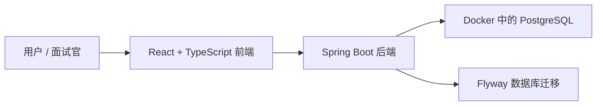

# FlowAI

[English README](./README.md)

FlowAI 是一个参考 Linear 体验的 AI 辅助任务管理 MVP。它的定位是面向奥克兰 software engineering、full-stack、backend 实习投递的作品集项目。

这个项目的目标不是完整复刻 Linear，而是在有限时间内做出一个可以运行、可以部署、可以演示、也能讲清楚技术深度的企业级全栈项目。

## 当前状态

FlowAI 目前处于 **Phase 0：项目定位与工程初始化**。

当前已经完成：

- 建立了 `backend/`、`frontend/`、`docs/` 的 monorepo 项目结构。
- 后端已经搭好 Spring Boot 骨架，并接入 PostgreSQL、Flyway、Spring Security、Actuator、JPA、Validation、Testcontainers 相关依赖。
- 使用 Docker Compose 启动本地 PostgreSQL 开发数据库。
- 前端已经搭好 Vite React TypeScript 骨架。
- 前端已接入 Tailwind CSS、shadcn/ui、React Router、TanStack Query。
- 后端已经有可公开访问的 Actuator health check。

当前还没有完成：

- 用户注册和登录。
- JWT 认证。
- Organization、Workspace、Member、Project、Issue 等业务模型。
- Linear 风格任务列表和看板。
- AI 辅助任务拆解和摘要。
- 生产部署配置。

## 技术栈

### 当前已经接入

| 范围 | 技术 |
| --- | --- |
| 后端 | Java 21, Spring Boot 3.5.x |
| API | Spring Web, Spring Validation |
| 持久化 | Spring Data JPA, Hibernate, PostgreSQL |
| 数据库迁移 | Flyway |
| 安全基础 | Spring Security |
| 健康检查 | Spring Boot Actuator |
| 测试基础 | JUnit 5, Testcontainers |
| 本地基础设施 | Docker Compose, PostgreSQL 17 Alpine |
| 前端 | React, TypeScript, Vite |
| 前端路由和请求缓存 | React Router, TanStack Query |
| 样式 | Tailwind CSS, shadcn/ui |

### 后续计划接入

| 范围 | 技术或能力 |
| --- | --- |
| 认证 | Spring Security with JWT |
| 表单 | React Hook Form, Zod |
| 多租户 | Organization 和 Workspace 数据隔离 |
| 任务管理 | Project, Issue, WorkflowState, Label, Comment, ActivityEvent |
| 看板交互 | dnd-kit |
| AI 功能 | Spring AI |
| 统计图表 | Recharts |
| 部署 | 完整 Docker Compose 应用栈 |

## 架构



在 Phase 0 阶段，Docker Compose 只负责启动 PostgreSQL。后端和前端暂时使用本地开发方式启动。

## 本地启动

### 前置要求

- Java 21
- Node.js 和 npm
- Docker Desktop

### 1. 启动 PostgreSQL

在项目根目录执行：

```bash
docker compose up -d postgres
```

PostgreSQL 连接信息：

- Host: `localhost`
- Port: `5432`
- Database: `flowai`
- User: `flowai`
- Password: `flowai_dev_password`

### 2. 启动后端

```bash
cd backend
./mvnw spring-boot:run
```

后端数据库连接配置在 `backend/src/main/resources/application.yaml`。

健康检查：

```bash
curl http://localhost:8080/actuator/health
```

预期返回：

```json
{"status":"UP"}
```

### 3. 启动前端

```bash
cd frontend
npm run dev
```

前端开发服务器由 Vite 提供。终端会显示本地访问地址，通常是：

```text
http://localhost:5173/
```

## 验证命令

后端：

```bash
cd backend
./mvnw test
```

前端：

```bash
cd frontend
npm run build
npm run lint
```

Phase 0 验收点：

- `docker compose up -d postgres` 可以启动 PostgreSQL。
- 后端 health check 返回 `UP`。
- 前端首页可以在浏览器访问。
- README 能说明项目定位、技术栈、架构和启动命令。

## 演示账号

演示账号占位：

- Email: `demo@flowai.local`
- Password: `flowai-demo-password`

认证功能会在 Phase 1 实现。注册、登录、JWT 认证和种子数据完成之后，这个演示账号才会真正可用。

## Roadmap

| 阶段 | 重点 | 状态 |
| --- | --- | --- |
| Phase 0 | 项目定位与工程初始化 | 进行中 |
| Phase 1 | 认证、组织、工作区、角色、JWT | 计划中 |
| Phase 2 | 核心任务管理：项目、任务、评论、活动记录 | 计划中 |
| Phase 3 | Linear 风格应用体验和看板 | 计划中 |
| Phase 4 | AI 任务拆解、摘要和统计分析 | 计划中 |
| Phase 5 | 测试、完整 Docker Compose、部署、面试材料 | 计划中 |

## 项目说明

FlowAI 会按照小阶段推进。每个阶段都应该让项目保持可运行、可解释，这样仓库不仅能展示最终功能，也能展示工程决策和学习过程。
