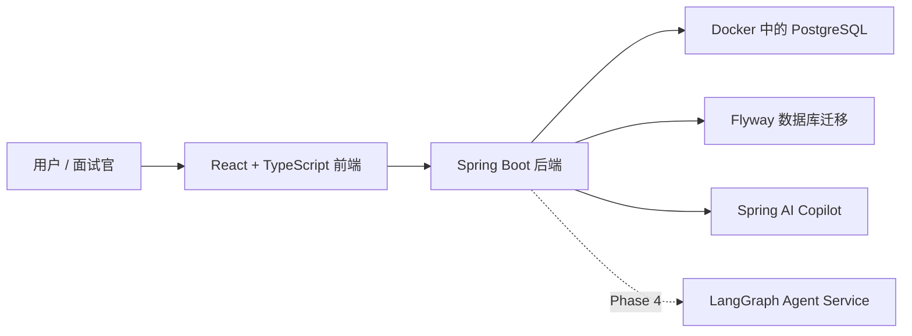

# FlowAI

[English README](./README.md)

FlowAI 是一个 workspace-first 的 AI 辅助任务管理 MVP，产品体验参考 Linear 和项目 issue tracker。它的定位是面向奥克兰 software engineering、full-stack、backend 实习投递的作品集项目。

这个项目的目标不是完整复刻 Linear，而是在有限时间内做出一个可以运行、可以部署、可以演示、也能讲清楚技术深度的企业级全栈项目。

## 当前状态

FlowAI 已完成 **Phase 0–3** 的主体实现；**Phase 4** 的 Analytics 与 Spring AI Copilot 已完成，LangGraph Agent 仍作为后续独立阶段开发。

当前已经完成：

- 完成注册、登录、refresh token rotation、多 workspace 切换、workspace member 和邀请管理。
- 完成 Project、project member、workflow state、label、归档和恢复管理。
- 完成 Issue 列表、过滤、游标分页、详情、评论、activity、优先级、负责人和截止日期。
- 完成 Linear 风格看板、跨状态拖拽、顺序持久化和 optimistic rollback。
- 完成 Analytics overview、状态/负责人分布和完成趋势页面。
- 完成 Spring AI Issue Breakdown：受限上下文、结构化输出、一次修复、可编辑抽屉、幂等事务 Apply 和 DRAFT suggestion 生命周期。
- 完成 Issue Summary 与 Project Summary：服务端来源统计、截断提示、草稿恢复、复制和刷新 UI。
- 完成 AI 用户/workspace 共享限流、低基数 metrics、安全日志和默认跳过的真实 OpenAI smoke test。
- 完成多租户数据库约束、API trace/metrics、rate limit、Docker Compose 全栈和 CI/Testcontainers/Playwright 测试。
- 已引入 Spring AI OpenAI starter，但 chat model 默认关闭，普通业务不依赖 provider key。

后续计划：

- 使用 Python、FastAPI 和 LangGraph 实现可暂停、可恢复、需要人工审批的 Project Planning Agent。
- 增加 Agent tools、checkpoint、评估和可选 MCP 集成。
- 完善部署、面试演示和求职材料。

## 技术栈

### 当前已经接入

| 范围 | 技术 |
| --- | --- |
| 后端 | Java 21, Spring Boot 3.5.x |
| API | Spring Web, Spring Validation |
| 持久化 | Spring Data JPA, Hibernate, PostgreSQL |
| 数据库迁移 | Flyway |
| 安全 | Spring Security, JWT Resource Server, BCrypt |
| Token | Access token 加 refresh token rotation |
| 健康检查 | Spring Boot Actuator |
| 测试基础 | JUnit 5, Testcontainers |
| 本地基础设施 | Docker Compose, PostgreSQL 17 Alpine |
| 前端 | React, TypeScript, Vite |
| 前端路由和请求缓存 | React Router, TanStack Query |
| 表单 | React Hook Form, Zod |
| 看板交互 | dnd-kit |
| 样式 | Tailwind CSS, shadcn/ui |
| AI Copilot | Spring AI、结构化任务拆解、Issue/Project 摘要、草稿生命周期与人工确认 |
| AI 工程质量 | prompt versioning、一次修复、token/latency metrics、限流、Provider smoke test |
| 容器化 | PostgreSQL、Spring Boot、Nginx/React 全栈 Docker Compose |

### 后续计划接入

| 范围 | 技术或能力 |
| --- | --- |
| Agent | Python、FastAPI、LangGraph、checkpoint、Human-in-the-loop |
| Agent 互操作 | FlowAI tools 与可选 MCP |
| Agent 工程质量 | 离线评估、checkpoint 与工具调用观测 |

## 架构



Docker Compose 已支持 PostgreSQL、后端和前端全栈运行。日常开发也可以只启动 PostgreSQL，再分别运行后端和前端以加快迭代。

## 本地启动

### 前置要求

- Java 21
- Node.js 和 npm
- Docker Desktop

### 1. 配置环境变量

从示例文件创建本地 `.env`：

```bash
cp .env.example .env
```

然后按需填写本地值。不要提交 `.env`。

当前 chat model 默认配置为 `none`，普通本地启动和测试不需要 `OPENAI_API_KEY`。启用真实 OpenAI provider 时设置 `AI_ENABLED=true`、`SPRING_AI_MODEL_CHAT=openai` 和 `OPENAI_API_KEY`。

### 2. 启动 PostgreSQL

在项目根目录执行：

```bash
docker compose up -d postgres
```

PostgreSQL 连接信息：

- Host: `localhost`
- Port: `5432`
- Database: `flowai`
- User: `flowai`
- Password: `flowai_dev_password`

### 3. 启动后端

```bash
cd backend
set -a; source ../.env; set +a
./mvnw spring-boot:run
```

健康检查：

```bash
curl http://localhost:8080/actuator/health
```

预期返回：

```json
{"status":"UP"}
```

### 4. 启动前端

```bash
cd frontend
npm run dev
```

Vite 本地访问地址通常是：

```text
http://localhost:5173/
```

## 主要 API（节选）

| Method | Endpoint | 作用 |
| --- | --- | --- |
| `POST` | `/api/auth/register` | 创建用户、默认 workspace、owner membership，并返回 tokens |
| `POST` | `/api/auth/login` | 使用 email 和 password 登录 |
| `POST` | `/api/auth/refresh` | 轮换 refresh token，并签发新的 access token |
| `GET` | `/api/me` | 返回当前 session：user + workspace |
| `GET` | `/api/workspaces/current` | 从 JWT 上下文返回当前 workspace |
| `GET` | `/api/workspaces/current/members` | 返回当前 workspace 的成员 |

受保护请求使用：

```http
Authorization: Bearer <access-token>
```

## 验证命令

后端：

```bash
cd backend
set -a; source ../.env; set +a
./mvnw test
./mvnw -Pintegration verify
```

前端：

```bash
cd frontend
npm run build
npm run lint
npm test
npm run test:e2e
```

核心验收点：

- 新用户可以注册。
- 注册时自动创建默认 workspace 和 `OWNER` membership。
- 登录后返回 access token 和 refresh token。
- `/api/me` 返回 `user` 和 `workspace`。
- 未登录用户不能访问 `/app`。
- 前端可以保存 token、附加 `Authorization`、自动刷新过期的 access token，并在 refresh 失败时退出登录。

## 演示账号

目前还没有提交固定种子演示账号。

本地演示时先通过注册页创建账号。等 Phase 2 或部署阶段需要稳定演示数据时，再补充 seed/demo account。

## Roadmap

| 阶段 | 重点 | 状态 |
| --- | --- | --- |
| Phase 0 | 项目定位与工程初始化 | 已完成 |
| Phase 1 | 认证、workspace membership、JWT、受保护 app shell | 本地完成 |
| Phase 2 | Project、项目成员或邀请、Issue、Comment、Activity | 主体完成 |
| Phase 3 | Linear 风格应用体验和看板 | 主体完成 |
| Phase 4 | Analytics、Spring AI Copilot、LangGraph Agent | 进行中：Analytics 与 Spring AI Copilot 已完成，Agent 待开发 |
| Phase 5 | 测试、完整 Docker Compose、部署、面试材料 | 计划中 |

## 项目说明

FlowAI 会按照小阶段推进。每个阶段都应该让项目保持可运行、可解释，这样仓库不仅能展示最终功能，也能展示工程决策和学习过程。

更多文档：

- [MVP Roadmap](./docs/mvp-roadmap.zh-CN.md)
- [Phase 1 设计说明](./docs/phase-1-auth-workspace.zh-CN.md)
- [Phase 4 AI Copilot 与 Agent 工作流设计](./docs/phase-4-ai-agent.zh-CN.md)
