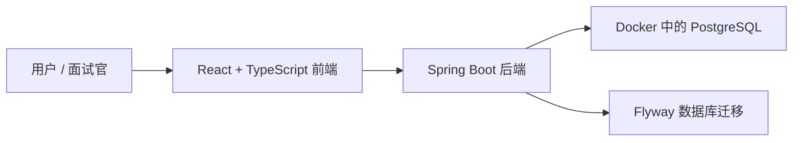

# FlowAI

[English README](./README.md)

FlowAI 是一个 workspace-first 的 AI 辅助任务管理 MVP，产品体验参考 Linear 和项目 issue tracker。它的定位是面向奥克兰 software engineering、full-stack、backend 实习投递的作品集项目。

这个项目的目标不是完整复刻 Linear，而是在有限时间内做出一个可以运行、可以部署、可以演示、也能讲清楚技术深度的企业级全栈项目。

## 当前状态

FlowAI 已完成 **Phase 0：工程初始化**，并完成 **Phase 1：认证与工作区访问** 的主体实现。

当前已经完成：

- 建立了 `backend/`、`frontend/`、`docs/` 的 monorepo 项目结构。
- 后端接入 Spring Boot、PostgreSQL、Flyway、Spring Security、JWT Resource Server、Actuator、JPA、Validation、Testcontainers。
- 使用 Docker Compose 启动本地 PostgreSQL 开发数据库。
- Flyway 已创建用户、工作区、工作区成员关系、refresh token 表。
- 已实现注册、登录、刷新 token、`/api/me` 当前会话接口。
- 采用 workspace-first 模型：用户通过 membership 加入 workspace；Phase 1 注册时自动创建默认 workspace。
- 前端已实现 `/app` 受保护路由。
- 前端已实现登录、注册、token 存储、access token 自动刷新、当前 session 加载。
- 前端已接入 Vite React TypeScript、Tailwind CSS、shadcn/ui、React Router、TanStack Query。

后续计划：

- Project、project member 或 invitation、Issue、Comment、Activity 模型。
- Linear 风格任务列表和看板。
- AI 辅助任务拆解和摘要。
- 统计分析和部署完善。

## 技术栈

### 当前已经接入

| 范围 | 技术 |
| --- | --- |
| 后端 | Java 21, Spring Boot 3.5.x |
| API | Spring Web, Spring Validation |
| 持久化 | Spring Data JPA, Hibernate, PostgreSQL |
| 数据库迁移 | Flyway |
| 安全 | Spring Security, JWT Resource Server, BCrypt |
| Token | Access token 加 refresh token rotation |
| 健康检查 | Spring Boot Actuator |
| 测试基础 | JUnit 5, Testcontainers |
| 本地基础设施 | Docker Compose, PostgreSQL 17 Alpine |
| 前端 | React, TypeScript, Vite |
| 前端路由和请求缓存 | React Router, TanStack Query |
| 样式 | Tailwind CSS, shadcn/ui |

### 后续计划接入

| 范围 | 技术或能力 |
| --- | --- |
| 表单 | React Hook Form, Zod |
| 项目管理 | Project, Project Member, Invitation, Issue, Comment, ActivityEvent |
| 看板交互 | dnd-kit |
| AI 功能 | Spring AI 任务拆解和摘要 |
| 统计图表 | Recharts |
| 部署 | 完整 Docker Compose 应用栈 |

## 架构



当前开发阶段，Docker Compose 只负责启动 PostgreSQL。后端和前端暂时使用本地开发方式启动，方便快速迭代。

## 本地启动

### 前置要求

- Java 21
- Node.js 和 npm
- Docker Desktop

### 1. 配置环境变量

从示例文件创建本地 `.env`：

```bash
cp .env.example .env
```

然后按需填写本地值。不要提交 `.env`。

当前后端已经引入 OpenAI Spring AI starter，所以即使 AI 产品功能还在后续阶段，本地启动和测试也可能需要 `OPENAI_API_KEY`。

### 2. 启动 PostgreSQL

在项目根目录执行：

```bash
docker compose up -d postgres
```

PostgreSQL 连接信息：

- Host: `localhost`
- Port: `5432`
- Database: `flowai`
- User: `flowai`
- Password: `flowai_dev_password`

### 3. 启动后端

```bash
cd backend
set -a; source ../.env; set +a
./mvnw spring-boot:run
```

健康检查：

```bash
curl http://localhost:8080/actuator/health
```

预期返回：

```json
{"status":"UP"}
```

### 4. 启动前端

```bash
cd frontend
npm run dev
```

Vite 本地访问地址通常是：

```text
http://localhost:5173/
```

## Phase 1 API

| Method | Endpoint | 作用 |
| --- | --- | --- |
| `POST` | `/api/auth/register` | 创建用户、默认 workspace、owner membership，并返回 tokens |
| `POST` | `/api/auth/login` | 使用 email 和 password 登录 |
| `POST` | `/api/auth/refresh` | 轮换 refresh token，并签发新的 access token |
| `GET` | `/api/me` | 返回当前 session：user + workspace |
| `GET` | `/api/workspaces/current` | 从 JWT 上下文返回当前 workspace |
| `GET` | `/api/workspaces/current/members` | 返回当前 workspace 的成员 |

受保护请求使用：

```http
Authorization: Bearer <access-token>
```

## 验证命令

后端：

```bash
cd backend
set -a; source ../.env; set +a
./mvnw test
```

前端：

```bash
cd frontend
npm run build
npm run lint
```

Phase 1 验收点：

- 新用户可以注册。
- 注册时自动创建默认 workspace 和 `OWNER` membership。
- 登录后返回 access token 和 refresh token。
- `/api/me` 返回 `user` 和 `workspace`。
- 未登录用户不能访问 `/app`。
- 前端可以保存 token、附加 `Authorization`、自动刷新过期的 access token，并在 refresh 失败时退出登录。

## 演示账号

目前还没有提交固定种子演示账号。

本地演示时先通过注册页创建账号。等 Phase 2 或部署阶段需要稳定演示数据时，再补充 seed/demo account。

## Roadmap

| 阶段 | 重点 | 状态 |
| --- | --- | --- |
| Phase 0 | 项目定位与工程初始化 | 已完成 |
| Phase 1 | 认证、workspace membership、JWT、受保护 app shell | 本地完成 |
| Phase 2 | Project、项目成员或邀请、Issue、Comment、Activity | 计划中 |
| Phase 3 | Linear 风格应用体验和看板 | 计划中 |
| Phase 4 | AI 任务拆解、摘要和统计分析 | 计划中 |
| Phase 5 | 测试、完整 Docker Compose、部署、面试材料 | 计划中 |

## 项目说明

FlowAI 会按照小阶段推进。每个阶段都应该让项目保持可运行、可解释，这样仓库不仅能展示最终功能，也能展示工程决策和学习过程。

更多文档：

- [MVP Roadmap](./docs/mvp-roadmap.zh-CN.md)
- [Phase 1 设计说明](./docs/phase-1-auth-workspace.zh-CN.md)
